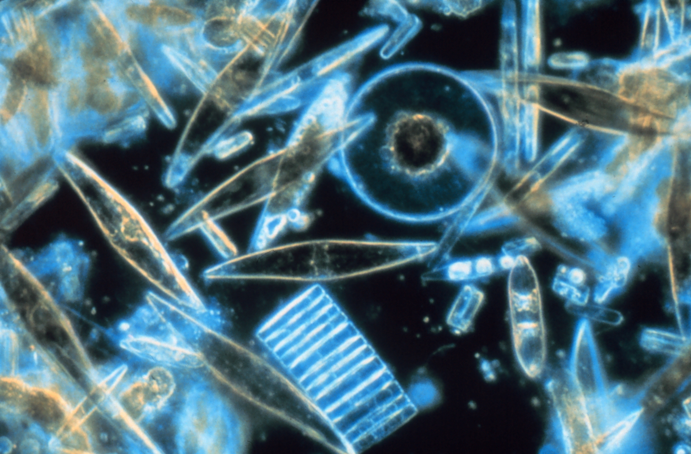

# PRO1 - Eukaryotic plankton diversity in the sunlit ocean
Sofia Klangby & Nubaid Khan

How to run the code:
The code in the form of a jupyter notebook which can be opened in google Colab and runned pressing the run bottom. To do so you need to dowload the data that can be accessed in the data folder. The data is stored in a zip file which can easily be unzipped and you get the tsv-file which is used in this project. 
